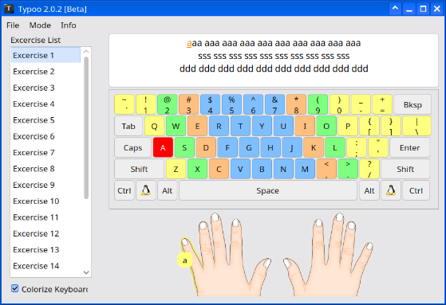

# Typoo2

A desktop application for **10-finger touch typing practice**, developed using **Gambas 3**.

Typoo2 is designed to help users improve their typing skills by practicing typing speed, accuracy, and proper finger placement on the keyboard.

## ✨ Features

* 🖥️ Desktop interface built with Gambas 3
* ⌨️ 10-finger touch typing practice
* 📖 Practice texts to improve typing skills
* ⏱️ Typing time measurement
* ⚡ Typing speed calculation
* 🎯 Typing accuracy calculation
* ❌ Character error detection
* 📊 Practice results
* 🔄 Repeat typing exercises

> Features may change and evolve as the application continues to be developed.

## 🖼️ Screenshot



## 🛠️ Technologies

This application is built using:

* **Gambas 3**
* **BASIC**
* **GTK / Qt**, depending on the components used by the project
* **Linux**

## 📋 Requirements

To run this application, you need:

* Linux
* Gambas 3
* A physical keyboard

Make sure that your installed version of Gambas 3 is compatible with the project's source code.

## 🚀 Installation

### 1. Clone the repository

```bash
git clone https://github.com/igkn-foundation/typoo2.git
```

Enter the project directory:

```bash
cd typoo2
```

### 2. Open the project

Open the project using the **Gambas 3 IDE**.

```bash
gambas3
```

Then select:

**File → Open Project**

and select the `typoo2` project directory.

### 3. Run the application

In the Gambas 3 IDE, press:

```text
F5
```

or select:

**Run → Run**

## 🏗️ Build

The project can be compiled using the Gambas 3 IDE.

To create an application package, use:

**Project → Make**

You can also use the packaging features provided by Gambas 3.

## 🎮 How to Use

1. Launch the application.
2. Select a typing exercise.
3. Place your fingers in the correct starting position on the keyboard.
4. Type the text displayed on the screen.
5. Try not to look at the keyboard while typing.
6. Complete the typing exercise.
7. Check your typing speed and accuracy results.

## 🤝 Contributing

Contributions, suggestions, and bug reports are welcome.

If you find a problem or have an idea for improving the application, please open an **Issue** in the repository.

Pull Requests are also welcome.

## 📄 License

This project is licensed under the **GNU General Public License v2.0 (GPL-2.0-only)**.

See the `LICENSE` file for the full license text.

## 👨‍💻 Developer

Developed using **Gambas 3** for the Linux desktop.
